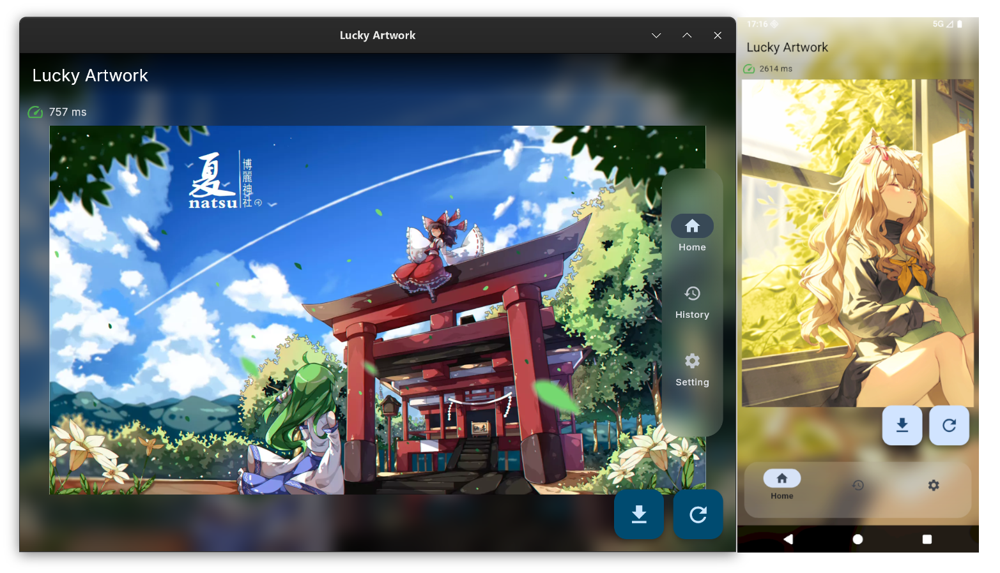

# Lucky Artwork

A Flutter framework project that uses an API to get a random illustration.

## Home Page

## Supported Platforms

## Cover Image

[Pixiv - 夏の博麗神社 - DanGo](https://www.pixiv.net/artworks/57086640)

[Pixiv - おひるね - おひるね](https://www.pixiv.net/artworks/88210047)

## Built-in API Providers

Thanks to the API providers, who provided the soul of this software.

[ManyACG](https://manyacg.top)

[Yuki](https://blog.yuki.sh)

[ZiChenACG](https://app.zichen.zone/api/acg)

[樱花二次元图片](https://www.dmoe.cc)

[东方Project随机图片](https://img.paulzzh.com)